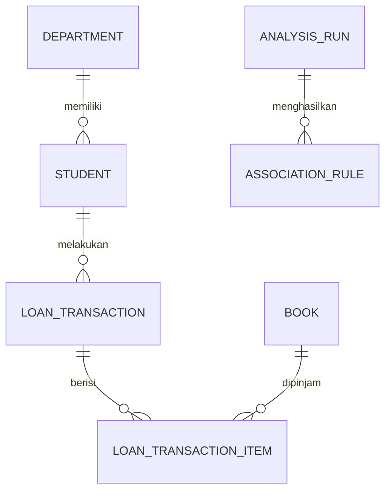
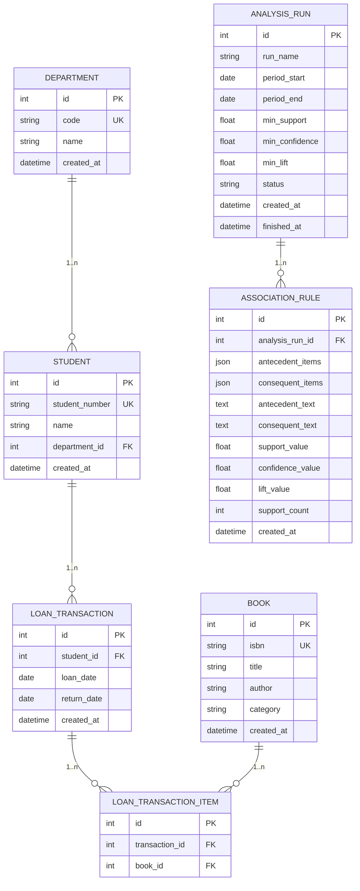
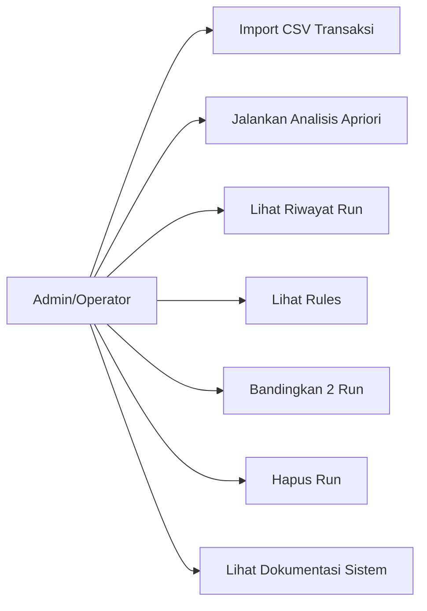
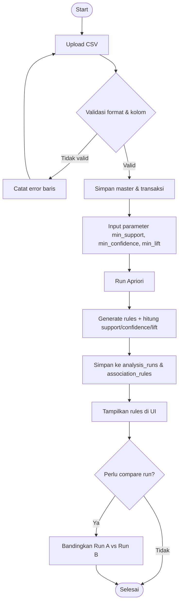
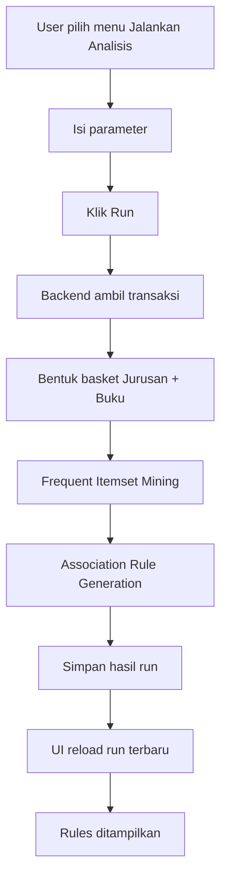
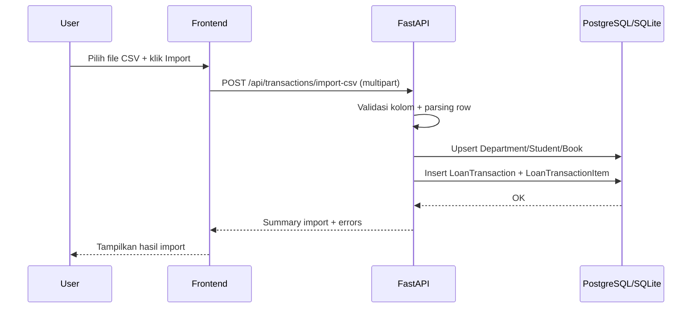
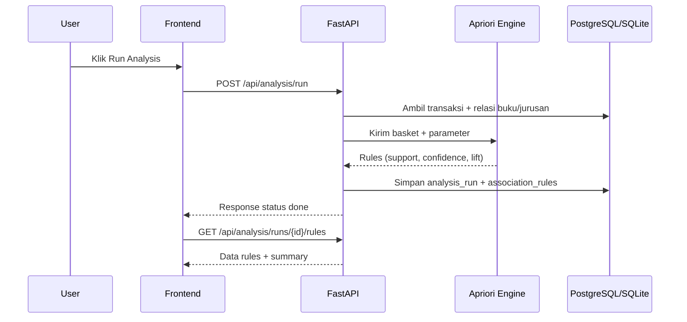
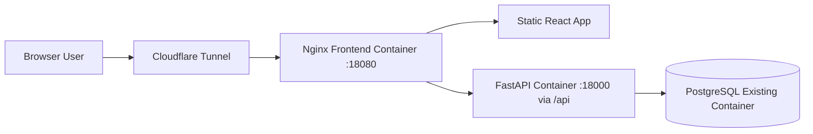
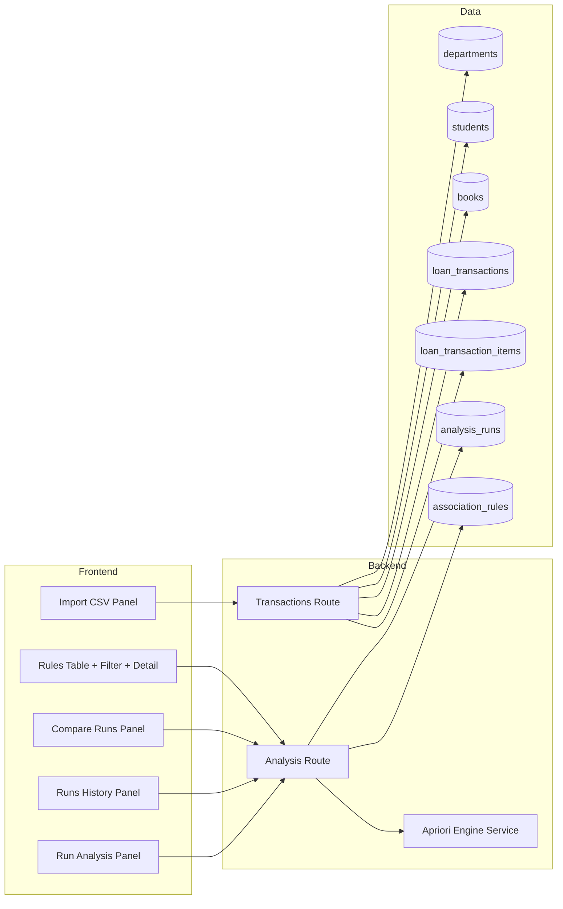

# Diagram Skripsi - Sistem Analisis Pola Peminjaman Perpustakaan

Dokumen ini berisi kumpulan diagram untuk kebutuhan skripsi berbasis implementasi sistem yang sudah berjalan.

## 1. Entity Diagram (Konseptual)

## 2. ERD (Logical + Atribut)

## 3. Use Case Diagram

## 4. Flowchart Proses Sistem (End-to-End)

## 5. Activity Diagram (Jalankan Analisis)

## 6. Sequence Diagram (Import CSV)

## 7. Sequence Diagram (Run Apriori)

## 8. Deployment Diagram

## 9. Arsitektur Komponen (Aplikasi)

## 10. Catatan untuk Laporan Skripsi

- Gunakan ERD pada Bab Perancangan Basis Data.
- Gunakan Flowchart/Activity/Sequence pada Bab Perancangan Sistem.
- Gunakan Deployment dan Arsitektur Komponen pada Bab Implementasi.
- Jika kampus mewajibkan gambar statis, render Mermaid ke PNG/SVG sebelum dimasukkan ke dokumen.
