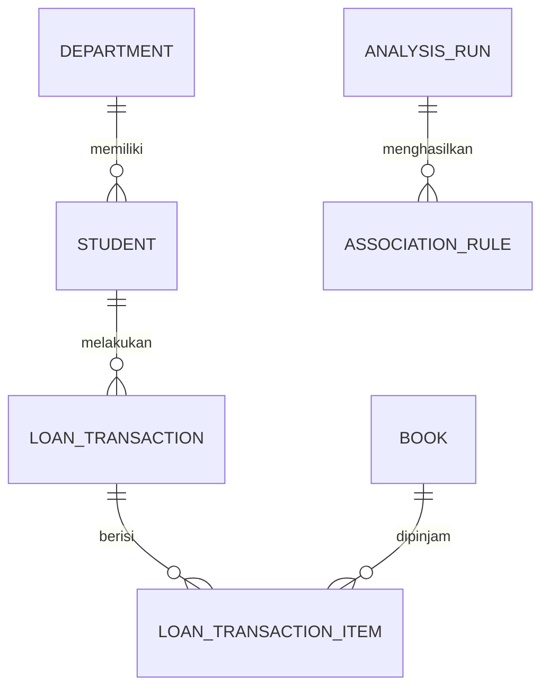
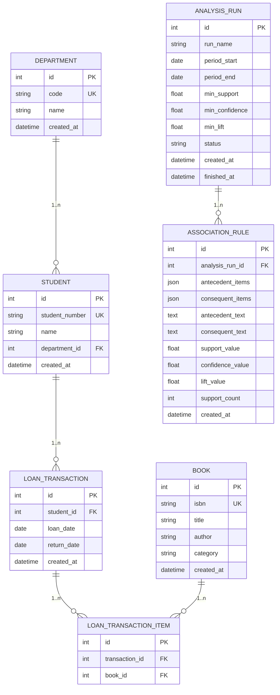
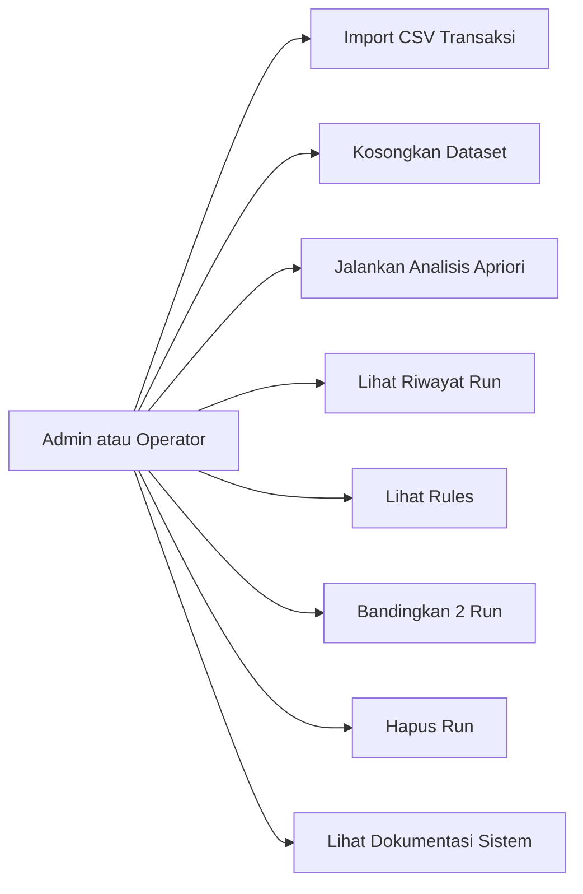
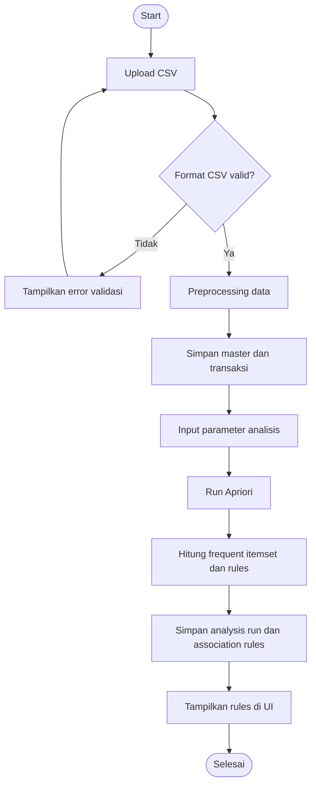
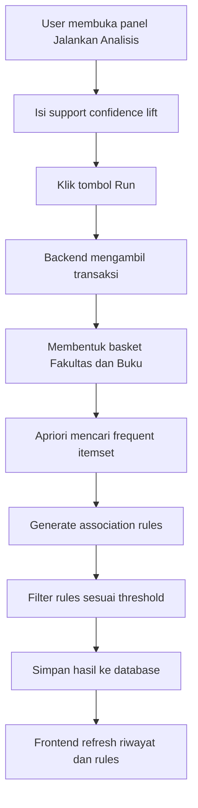
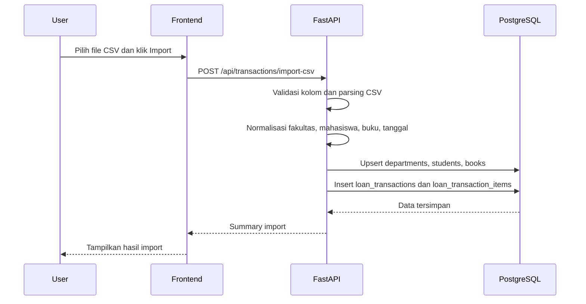
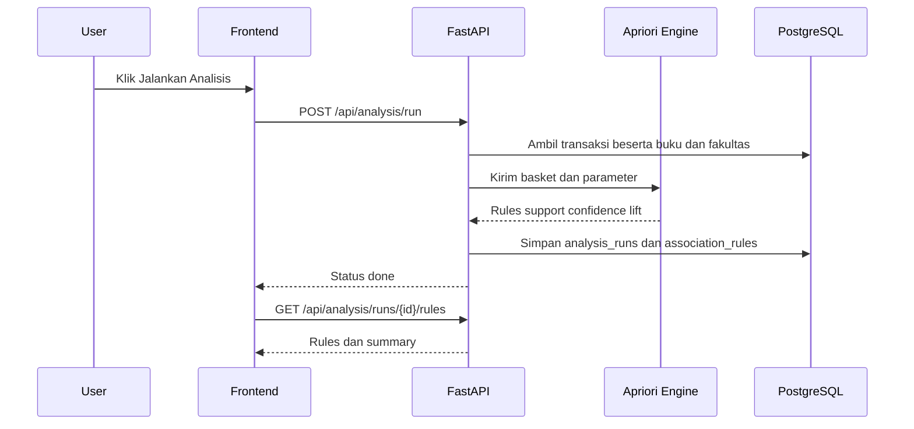
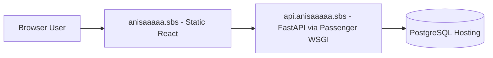
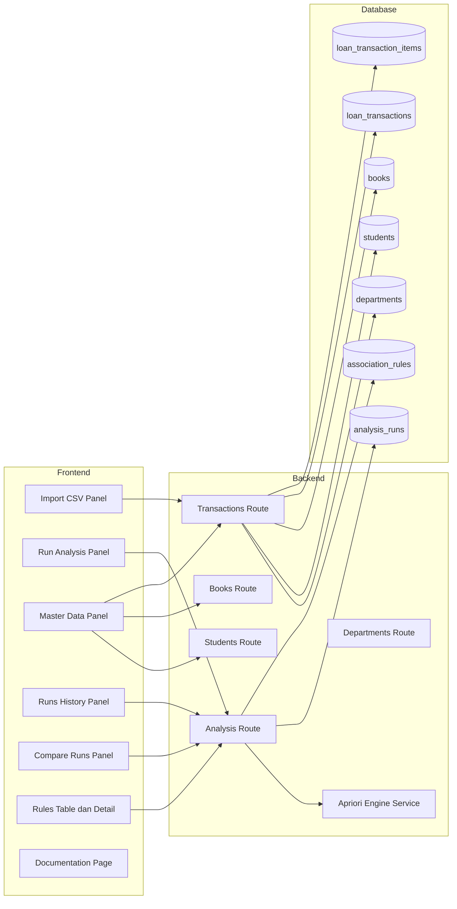

# Diagram Skripsi - Sistem Analisis Pola Peminjaman Perpustakaan

Dokumen ini berisi diagram yang relevan dengan implementasi sistem Apriori Engine.

## 1. Entity Diagram Konseptual

## 2. ERD Logical

## 3. Use Case Diagram

## 4. Flowchart End-to-End

## 5. Activity Diagram Jalankan Analisis

## 6. Sequence Diagram Import CSV

## 7. Sequence Diagram Run Apriori

## 8. Deployment Diagram Production

## 9. Arsitektur Komponen

## 10. Catatan untuk Laporan

- Entity Diagram dan ERD dapat digunakan pada bagian perancangan basis data.
- Use Case, Activity, Sequence, dan Flowchart dapat digunakan pada bagian perancangan sistem.
- Deployment Diagram dapat digunakan pada bagian implementasi.
- Jika laporan membutuhkan gambar statis, gunakan PNG yang sudah tersedia pada halaman dokumentasi.
